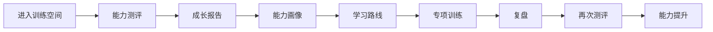
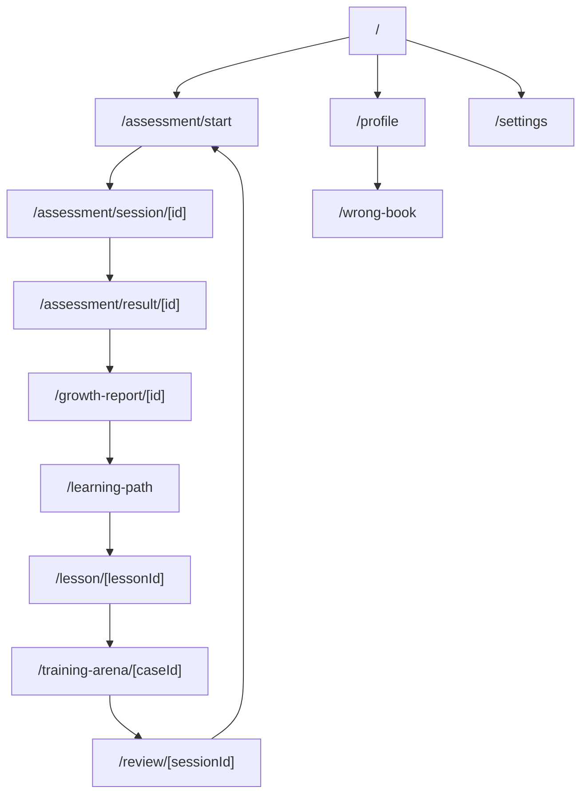
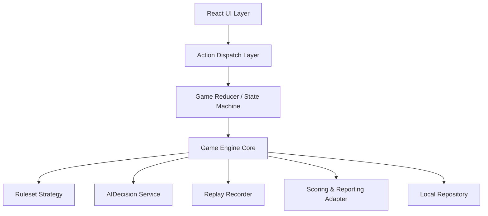
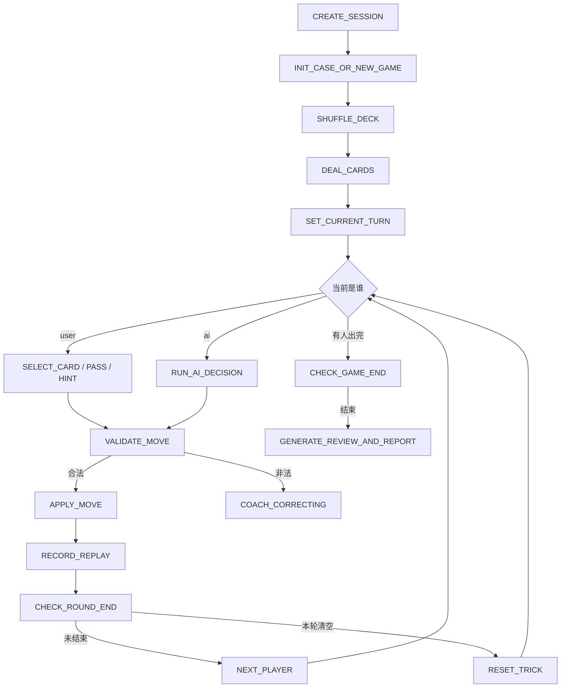
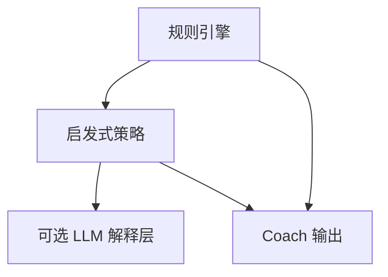
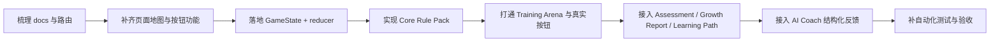

# AI掼蛋训练系统 V2 产品总纲

## 执行摘要

这份《AI 掼蛋训练系统 V2 产品总纲》将你现有的产品文档，统一收束成一套**可以直接交给 Codex、Cursor、Claude Code 执行**的单一规范。它的核心结论只有一句话：

> **这个产品不是棋牌大厅、不是文章课程站、也不是“会说话的 AI 头像”；它是一个以 Ace 教练为中枢、围绕“测评 → 画像 → 路线 → 训练 → 复测 → 提升”闭环运行的移动端横屏 AI 掼蛋能力训练系统。** fileciteturn0file0 fileciteturn0file3 fileciteturn0file6 fileciteturn0file10

现有文档已经把产品方向讲得很清楚：首页应该像 Training Arena，而不是功能大厅；Ace 的职责是欢迎、讲解、纠错、复盘和推动下一步；课程和残局必须数据驱动；扑克牌真实牌面应由前端组件渲染，不能交给图片生成；V1 的原则是轻动画、短反馈、移动端优先。V2 的核心工作，不是再“做一个更好看的页面”，而是给现有 UI 补上**完整的状态机、按钮功能、规则引擎、训练关卡、成长报告、学习路线与开发验收制度**。fileciteturn0file5 fileciteturn0file6 fileciteturn0file7 fileciteturn0file9 fileciteturn0file12 fileciteturn0file13

本稿对若干未明确事项做了显式标注。最关键的“未指定”包括：**正式采用哪一版权威掼蛋竞赛规则、当前代码框架具体版本、团队规模、时间预算**。因此，文中采用的工程实现口径是：**V2 先固定一个训练版 Core Rule Pack**，实现核心可训练牌型与回合闭环；进贡、还贡、逢人配、异地竞赛细则等高级规则通过 `ruleset` 策略层可插拔，不在没有固定规则版本前写死。Next.js App Router、React reducer、Motion、GSAP 与 OpenAI 图像/结构化输出的技术建议，均以官方文档为准。citeturn4view0turn3view1turn5view0turn4view6turn3view6turn3view9

如果你把这份文档放进 `docs/AI_GUANDAN_PRODUCT_MASTER_SPEC.md`，并要求任何 AI 编程工具在改代码前先阅读它，那么后续开发将从“做出一个像样的静态 Demo”，升级为“做出一个真正能训练、能反馈、能复测、能证明用户成长的产品”。fileciteturn0file6 fileciteturn0file10

## 目录

- 前置假设与设计边界
- 产品蓝图与页面体系
- 游戏引擎与交互规范
- AI、课程与成长闭环
- 开发执行、验收与主提示词

## 前置假设与设计边界

### 核心产品定义

产品定义已经在现有文档中形成高度一致：它是 **AI 掼蛋训练空间 / AI 掼蛋教练训练 App**，不是课程站、棋牌大厅、文章平台、规则百科，也不是单纯刷题工具。Ace 不是装饰性吉祥物，而是训练中枢，负责把首页引导、课程讲解、残局反馈、复盘总结和成长推荐串成一个连续体验。fileciteturn0file0 fileciteturn0file6 fileciteturn0file10 fileciteturn0file11

V2 的北极星体验应明确定义为：



这个闭环与现有 Product Architecture、Game UI Direction、Visual Color System 的叙述完全一致，即系统必须先识别用户当前水平，再把短板转化为下一步训练动作。fileciteturn0file4 fileciteturn0file5 fileciteturn0file6

### 目标用户与优先设备

目标用户以两类为主。第一类是**新手与入门玩家**，他们不知道为什么输、规则理解不稳、牌型识别和出牌判断不稳定；第二类是**中级与进阶玩家**，他们会打，但经常凭感觉出牌，尤其在炸弹时机、牌权控制、队友配合和残局收尾上不稳定。高阶用户可作为 V2 次级目标，用于残局推演、协同判断和复测验证。fileciteturn0file0 fileciteturn0file6 fileciteturn0file11

设备优先级必须明确为：

| 设备类型 | 优先级 | 设计口径 | 说明 |
|---|---|---|---|
| Mobile Landscape 16:9 | P0 | **主设计基准** | 本文档强制基准 |
| Tablet Landscape | P1 | 同结构放大 | 不重做信息架构 |
| Desktop Browser | P2 | 仅做 scale-up 展示 | 不允许另起一套桌面 IA |
| Mobile Portrait | 未指定 | 默认不作为主版本 | 仅允许提示横屏使用 |

这一定义与现有文档“移动端优先”“390px–430px 宽度基准”“桌面端只是扩展布局而不改变核心体验”的方向一致；本稿进一步把其收敛成**横屏训练系统**，不再允许 Codex 混写桌面与手机两套完全不同结构。fileciteturn0file3 fileciteturn0file11 fileciteturn0file13

### 未指定项与建议方案

| 项目 | 当前状态 | 保守方案 | 激进方案 |
|---|---|---|---|
| 权威掼蛋规则版本 | **未指定** | 先固定一套训练版 Core Rule Pack，仅实现核心牌型与回合 | 直接做 `rulesetId` 插件体系，同时支持训练规则与赛事规则 |
| 现有 Next/React/Tailwind/Motion 具体版本 | **未指定** | 保留现有依赖，先不升级框架，只补功能 | 升到当前稳定版后统一重构 App Router 与动画接口 |
| 团队规模 | **未指定** | 1 产品 + 1 前端/全栈 | 1 产品 + 1 前端 + 1 全栈 + 1 设计/内容 |
| 时间预算 | **未指定** | 4–6 次迭代，先打通闭环 | 3–4 次迭代，并行推进内容与引擎 |
| 数据持久层 | V1 偏本地 | 继续 localStorage / IndexedDB | 抽象 Repository，预留 Supabase/服务端切换 |

以上“未指定”并不是问题；问题在于**不显式标注未指定，却让 AI 编码工具自行脑补**。所以这份文档要求所有未指定项都先标红，再选择保守或激进实现口径。现有文档本身也明确建议：V1 与早期 V2 要优先升级信息架构与状态逻辑，而不是过早引入复杂 AI、数据库或动画。fileciteturn0file6 fileciteturn0file7 fileciteturn0file12

## 产品蓝图与页面体系

### 全站页面地图

下表是建议采用的 V2 页面地图。路径命名为**本稿建议**；现有项目并未完全指定最终 URL 结构，因此以下路由属于“建议口径”，但页面目标与组件边界严格依据现有文档整理。fileciteturn0file3 fileciteturn0file5 fileciteturn0file6 fileciteturn0file10

| 路径 | 页面名 | 页面目标 | 关键组件 | 优先级 |
|---|---|---|---|---|
| `/` | Home / Training Arena | 用户 5 秒内知道今天练什么、为什么练、点哪里开始、完成后得到什么 | `AceCoachHero` `CurrentLevelCard` `SkillAssessmentBar` `TrainingRecommendationCard` `PrimaryCTA` | P0 |
| `/assessment/start` | 测评入口 | 说明测评目的、选择用户水平、创建测评 session | `AssessmentIntroCard` `LevelChooser` `AceCoachBubble` | P0 |
| `/assessment/session/[id]` | 测评过程 | 收集能力信号，完成若干判断题 | `AssessmentCaseViewer` `AnswerOptions` `CoachHintBar` `ProgressHeader` | P0 |
| `/assessment/result/[id]` | 测评结果 | 给出当前水平、主要短板、下一步建议 | `AssessmentResultCard` `AceDiagnosisCard` `CTAGroup` | P0 |
| `/growth-report/[id]` | 成长报告 | 生成并展示完整诊断、强项、短板、推荐训练 | `GrowthSummary` `AbilityProfileCard` `ActionPlanCard` | P0 |
| `/learning-path` | 学习路线 | 把短板转成节点化路径 | `PathOverview` `PathNodeList` `RetestGateCard` | P0 |
| `/lesson/[lessonId]` | 知识课 | 一页只讲一个判断点，避免长文章 | `LessonViewer` `CoachInline` `PokerCaseStep` `MiniQuiz` | P0 |
| `/training-arena/[caseId]` | 专项训练牌桌 | 真实训练桌，完成选牌、出牌、AI 动作、即时反馈 | `TableLayout` `OpponentPanels` `HandCards` `PlayBar` `CoachFeedbackPanel` | P0 |
| `/review/[sessionId]` | 复盘 | 总结最大问题与下次训练方向 | `ReplayTimeline` `CoachReviewCard` `RetryCTA` | P0 |
| `/profile` | 成长档案 | 看见长期变化、历史报告、错题与建议 | `ProfileSummary` `HistoryReports` `WeaknessList` `TodayActionCard` | P1 |
| `/wrong-book` | 错题本 | 面向复训，提高留存 | `WrongCaseList` `RetryQueue` | P1 |
| `/settings` | 设置 | 规则集、动效、性能模式、本地数据管理 | `RulesetSelector` `AnimationToggle` `DataResetGroup` | P1 |

页面层级建议如下：



### 页面按钮功能总原则

所有按钮必须满足以下八项约束：

1. 必须说明按钮只在什么状态下可点。  
2. 必须映射唯一事件。  
3. 必须对应具体函数或 skill。  
4. 必须改变真实状态，而不是只做视觉切换。  
5. 必须有用户可见反馈。  
6. 必须有验收标准。  
7. 如果没有真实逻辑，不创建按钮。  
8. 如果按钮只是“跳页面”，也必须先完成必要状态写入。  

这一原则与现有“首页不是功能入口集合”“行动优先”“每次训练必须闭环”“AI Coach 必须辅助决策而非制造打扰”“课程和练习必须数据驱动”的规则一致。fileciteturn0file3 fileciteturn0file9 fileciteturn0file10

### 每页按钮功能表

以下按钮表为 V2 正式执行口径。若页面未列按钮，视为该按钮**不应存在**。所有函数名为建议命名，可直接用于前端 action / use case / service 设计。

#### 首页按钮表

| 页面 | 按钮 | 当前状态 | 触发事件 | 调用函数/skill | 状态变化 | 用户可见反馈 | 验收标准 |
|---|---|---|---|---|---|---|---|
| `/` | 开始测评 | 未测评 / 建议复测 | `CLICK_START_ASSESSMENT` | `createAssessmentSession()` | 创建 `assessmentSession`，写入首题、维度计划、开始时间 | 跳转 `/assessment/start` 或直接进入 session；Ace 提示“先做一轮判断” | session 真实创建，刷新后可恢复 |
| `/` | 继续训练 | 有未完成路径节点 | `CLICK_CONTINUE_TRAINING` | `getNextRecommendedNode()` | 载入下一课程或训练 case | 跳转到推荐节点 | 必须进入上次未完成节点，不允许跳错 |
| `/` | 查看画像 | 已有报告 | `CLICK_VIEW_PROFILE` | `openLatestGrowthReport()` | currentRoute 切到报告页 | 打开最新成长报告 | 报告加载正确，显示最近一份 |
| `/` | 开始推荐训练 | 已有短板推荐 | `CLICK_START_RECOMMENDED_CASE` | `startTrainingFromRecommendation()` | 创建 training session | 跳转训练牌桌 | 推荐 case 与短板维度一致 |
| `/` | 再次测试 | 已完成上一条训练链 | `CLICK_RETEST` | `createRetestSession()` | 创建 `assessmentSession`，标记 `mode=retest` | 跳转测评页并显示“复测”标签 | 复测结果可与上次对比 |
| `/` | 查看学习路线 | 已有报告 | `CLICK_VIEW_PATH` | `buildOrOpenLearningPath()` | 读取或生成 `learningPath` | 跳转 `/learning-path` | 路线节点与短板对应 |
| `/` | 去错题复训 | 有错题 | `CLICK_WRONG_BOOK` | `openWrongBook()` | 跳转错题页 | 打开错题列表 | 错题数量与历史一致 |

#### 测评入口与过程按钮表

| 页面 | 按钮 | 当前状态 | 触发事件 | 调用函数/skill | 状态变化 | 用户可见反馈 | 验收标准 |
|---|---|---|---|---|---|---|---|
| `/assessment/start` | 选择新手 | 初始 | `SELECT_LEVEL_BEGINNER` | `setAssessmentTier("beginner")` | `assessmentConfig.tier=beginner` | 选中高亮 | 进入 session 使用该题组 |
| `/assessment/start` | 选择中级 | 初始 | `SELECT_LEVEL_INTERMEDIATE` | `setAssessmentTier("intermediate")` | 同上 | 同上 | 同上 |
| `/assessment/start` | 选择高级 | 初始 | `SELECT_LEVEL_ADVANCED` | `setAssessmentTier("advanced")` | 同上 | 同上 | 同上 |
| `/assessment/start` | 开始测评 | 已选 tier | `CLICK_BEGIN_ASSESSMENT` | `startAssessmentSession()` | 进入第 1 题，记录起始时间 | 跳转 session 页 | 未选 tier 时按钮禁用 |
| `/assessment/start` | 返回首页 | 任意 | `CLICK_BACK_HOME` | `router.push("/")` | 不变 | 返回首页 | 不丢失已选 tier 草稿 |
| `/assessment/session/[id]` | 选项 A/B/C/D | 未作答 | `SUBMIT_ANSWER_OPTION` | `submitAssessmentAnswer(optionId)` | 写入答案、评分信号、Coach 状态 | 即时正确/错误反馈 | 每题只能结算一次 |
| `/assessment/session/[id]` | 提示 | 未作答 | `REQUEST_HINT` | `getAssessmentHint()` | `hintUsed=true` | Ace 给 thinking 类提示 | 不能直接泄露答案 |
| `/assessment/session/[id]` | 下一题 | 已结算当前题 | `NEXT_QUESTION` | `goToNextAssessmentCase()` | `currentIndex+1` | 进度条推进 | 最后一题后进入结果页 |
| `/assessment/session/[id]` | 暂停退出 | 任意 | `PAUSE_ASSESSMENT` | `pauseAssessmentSession()` | session 标记 paused | 返回首页，显示“下次继续” | 恢复后回到当前题 |

#### 结果、报告与路线按钮表

| 页面 | 按钮 | 当前状态 | 触发事件 | 调用函数/skill | 状态变化 | 用户可见反馈 | 验收标准 |
|---|---|---|---|---|---|---|---|
| `/assessment/result/[id]` | 查看成长报告 | 已生成摘要 | `OPEN_GROWTH_REPORT` | `generateGrowthReport()` | 生成 `reportId` | 跳转报告页 | 报告维度完整 |
| `/assessment/result/[id]` | 开始推荐训练 | 已识别短板 | `OPEN_RECOMMENDED_TRAINING` | `startRecommendedTraining()` | 建立 training session | 跳转训练页 | 推荐与短板一致 |
| `/assessment/result/[id]` | 重新测评 | 任意 | `RESTART_ASSESSMENT` | `createAssessmentSession()` | 新建 session | 重进测评 | 不覆盖旧结果 |
| `/growth-report/[id]` | 展开维度详情 | 报告加载成功 | `EXPAND_DIMENSION_DETAIL` | `toggleDimensionPanel(dimensionId)` | UI state 变化 | 打开维度说明 | 不影响总分 |
| `/growth-report/[id]` | 生成学习路线 | 报告存在 | `GENERATE_LEARNING_PATH` | `generateLearningPathFromReport(reportId)` | 持久化路径节点 | 跳转 learning path | 路线至少含 1 条主线 |
| `/growth-report/[id]` | 开始第一训练 | 路线已生成 | `START_FIRST_NODE` | `startFirstPathNode()` | 建立 `lessonSession` 或 `trainingSession` | 进入第一节点 | 节点类型正确 |
| `/growth-report/[id]` | 导出报告 | 报告存在 | `EXPORT_REPORT` | `exportGrowthReport("pdf"|"png")` | 生成导出文件 | 下载反馈 | 文件包含摘要与图表 |
| `/learning-path` | 开始节点训练 | 节点可学 | `START_PATH_NODE` | `openPathNode(nodeId)` | 当前节点状态变 `in_progress` | 进入课程/训练 | 状态可恢复 |
| `/learning-path` | 标记稍后 | 节点未开始 | `DEFER_NODE` | `deferPathNode(nodeId)` | 节点状态变 `deferred` | 显示“稍后再练” | 不影响主线节点排序 |
| `/learning-path` | 去复测 | 满足复测门槛 | `OPEN_RETEST_GATE` | `createRetestSessionFromPath()` | 复测 session 建立 | 进入复测 | 未达门槛时禁用 |

#### 课程、牌桌、复盘与设置按钮表

| 页面 | 按钮 | 当前状态 | 触发事件 | 调用函数/skill | 状态变化 | 用户可见反馈 | 验收标准 |
|---|---|---|---|---|---|---|---|
| `/lesson/[lessonId]` | 上一步 | 非第一步 | `PREV_STEP` | `goPrevLessonStep()` | `stepIndex-1` | 步骤切换 | 动画不丢状态 |
| `/lesson/[lessonId]` | 下一步 | 非最后一步 | `NEXT_STEP` | `goNextLessonStep()` | `stepIndex+1` | 步骤切换 | 正确进入下一步 |
| `/lesson/[lessonId]` | 收藏 | 任意 | `TOGGLE_FAVORITE_LESSON` | `toggleFavoriteLesson()` | 收藏状态翻转 | icon 状态变化 | 刷新后保留 |
| `/lesson/[lessonId]` | 去练习 | lesson 完成或最小可练状态 | `START_LINKED_PRACTICE` | `openLinkedPracticeCase()` | 建立 training session | 跳转牌桌 | 关联正确 case |
| `/training-arena/[caseId]` | 选牌 | 可交互 | `SELECT_CARD` | `selectCard(cardId)` | `selectedCardIds` 更新 | 卡牌 poke 上移 | 多选顺滑、不误判 |
| `/training-arena/[caseId]` | 取消选牌 | 已选中 | `DESELECT_CARD` | `deselectCard(cardId)` | 从选择集移除 | 牌回落 | 状态即时同步 |
| `/training-arena/[caseId]` | 自动整理 | 任意 | `SORT_HAND` | `sortHand(sortMode)` | 手牌顺序变化 | 重新排列动画 | 不改动牌集合 |
| `/training-arena/[caseId]` | 提示 | 当前轮到玩家 | `REQUEST_COACH_HINT` | `requestCoachHint()` | `hintState` 更新 | Ace 给方向型提示 | 不可直接给答案 |
| `/training-arena/[caseId]` | 不出 | 当前允许 pass | `PASS_TURN` | `passTurn()` | `lastAction=pass`，轮到下一家 | 明确显示“不出” | 不允许在首出轮无故 pass |
| `/training-arena/[caseId]` | 出牌 | 已选牌且合法 | `PLAY_SELECTED_MOVE` | `submitSelectedMove()` | move 入栈、手牌减少、回合推进 | 牌移动到桌面中央 | 非法牌型时必须阻止 |
| `/training-arena/[caseId]` | 重开本题 | 任意 | `RESTART_CASE` | `restartTrainingCase()` | 重新初始化 case state | 回到初始牌局 | 积分/日志按规则处理 |
| `/training-arena/[caseId]` | 退出训练 | 任意 | `EXIT_TRAINING` | `exitTrainingSession()` | 保存中间结果 | 返回首页/路线 | 可恢复或明确放弃 |
| `/review/[sessionId]` | 上一步复盘 | 非第一步 | `PREV_REPLAY_STEP` | `goPrevReplayStep()` | replay index 回退 | 回看上一节点 | 时间线同步 |
| `/review/[sessionId]` | 下一步复盘 | 非最后一步 | `NEXT_REPLAY_STEP` | `goNextReplayStep()` | replay index 前进 | 看下一步分析 | Coach 评论同步 |
| `/review/[sessionId]` | 再练一次 | 任意 | `RETRY_CASE` | `retryTrainingCase()` | 建立新训练 session | 重进牌桌 | case 相同，日志新建 |
| `/review/[sessionId]` | 去复测 | 满足门槛 | `OPEN_RETEST` | `createRetestSession()` | 建立复测 session | 进入复测 | 携带来源维度 |
| `/settings` | 切换规则集 | 有多个 ruleset | `CHANGE_RULESET` | `setRuleset(rulesetId)` | `userPreference.rulesetId` 更新 | 提示需重载新局 | 不影响已完成报告 |
| `/settings` | 动效开关 | 任意 | `TOGGLE_ANIMATION` | `setAnimationEnabled()` | 偏好更新 | 即时生效 | 低性能模式生效 |
| `/settings` | 清空本地数据 | 二次确认后 | `RESET_LOCAL_DATA` | `resetLocalStorageData()` | 清空 progress/report/cache | 成功 toast | 必须二次确认 |

这些按钮设计，直接把现有文档中的“行动优先”“按钮必须服务闭环”“Coach 不可喧宾夺主”“课程与练习通过数据联动”“Profile 是成长档案而不是设置页”落成到可执行级别。fileciteturn0file3 fileciteturn0file9 fileciteturn0file10 fileciteturn0file11 fileciteturn0file13

## 游戏引擎与交互规范

### 游戏引擎总结构

V2 不能再由页面直接拼交互，而必须引入显式的 `Game Engine` 分层。推荐结构如下：



之所以推荐这个结构，是因为 React 官方文档明确建议随着应用增长，更有意识地组织状态和数据流；当多个事件处理器都修改同一批状态时，把逻辑集中到 reducer 中更易维护。与此同时，Next.js App Router 适合用文件系统路由组织页面、布局与 handlers；Motion 适合做与状态绑定的微交互；GSAP 则更适合在确实需要复杂时间轴时接管复杂动画。citeturn3view0turn3view1turn4view0turn5view0turn5view3turn4view6

### 训练版规则口径

**规则正式版本：未指定。**  
因此本稿给出**训练版 Core Rule Pack**，用于先打通训练产品闭环，而不是抢先覆盖所有地方变体。实现建议：

- 默认局制：4 人、两两对家、双副牌。  
- 发牌：每人 27 张。  
- V2 必做牌型：单张、对子、三张、三带二、顺子、连对、钢板、炸弹、同花顺。  
- V2 可选牌型：火箭/王炸，是否存在取决于固定 ruleset。  
- V2 暂缓写死：进贡、还贡、抗贡、逢人配、报数口径、赛事细则差异。  
- 高级规则通过 `rulesetId` 注入，不要在 UI 里写死。  

掼蛋作为四人对家配合、双副牌升级类游戏，已经被纳入全国智力运动会表演项目；但不同地方与竞赛规则在高级细节上可能不同，因此开发前必须固定规则版本，否则 AI 玩家策略、牌型判断和复盘结论都会漂移。citeturn11search0turn8search2

### 状态模型

建议使用单一 `GameState`，并把学习进度与成长状态挂到 session 外层，而不是塞进 UI 组件局部状态。

```ts
type PlayerId = "user" | "leftAI" | "topAI" | "rightAI";

type CoachState =
  | "welcome"
  | "teaching"
  | "praise"
  | "correcting"
  | "thinking"
  | "review";

type MoveType =
  | "single"
  | "pair"
  | "triple"
  | "three_with_two"
  | "straight"
  | "serial_pairs"
  | "steel_plate"
  | "bomb"
  | "straight_flush"
  | "rocket"
  | "pass";

interface Card {
  id: string;
  suit: "spade" | "heart" | "club" | "diamond" | "joker";
  rank: number; // 3..15, 小王/大王可扩展
  isWildcard?: boolean; // 视 ruleset 决定
}

interface Move {
  id: string;
  playerId: PlayerId;
  type: MoveType;
  cards: Card[];
  power: number;
  beatenMoveId?: string;
  timestamp: number;
}

interface PlayerState {
  id: PlayerId;
  seat: "bottom" | "left" | "top" | "right";
  hand: Card[];
  finished: boolean;
  finishOrder?: number;
  team: "A" | "B";
}

interface TableState {
  lastNonPassMove?: Move;
  trickMoves: Move[];
  roundLeader: PlayerId;
  currentTurn: PlayerId;
  passCount: number;
}

interface TrainingMeta {
  caseId: string;
  targetAbility:
    | "rules"
    | "pattern"
    | "initiative"
    | "bomb_timing"
    | "teamwork"
    | "risk_control"
    | "endgame";
  difficulty: "beginner" | "intermediate" | "advanced";
  evaluationMode: "assessment" | "training" | "retest";
}

interface CoachMessage {
  id: string;
  state: CoachState;
  text: string;
  reason?: string;
  nextAction?: string;
  source: "static" | "rule" | "ai";
}

interface GameState {
  sessionId: string;
  status:
    | "idle"
    | "dealing"
    | "user_turn"
    | "ai_turn"
    | "animating"
    | "reviewing"
    | "finished";
  rulesetId: string;
  deck: Card[];
  players: Record<PlayerId, PlayerState>;
  table: TableState;
  selectedCardIds: string[];
  legalMovesCache: Move[];
  coach?: CoachMessage;
  replay: Move[];
  training: TrainingMeta;
  scoreSignals: {
    correctness: number;
    hintUsed: boolean;
    responseMs?: number;
    dimensionWeights: Record<string, number>;
  };
}
```

这个状态口径与现有 Coach 状态系统、课程/残局数据驱动、Progress 记录、V1 本地存储方案天然兼容；同时也与 React reducer 的推荐用法一致，因为后续大多数页面按钮都只是在 dispatch action，而不应自己散落维护业务状态。fileciteturn0file0 fileciteturn0file9 fileciteturn0file11 citeturn3view1turn3view2

### 事件流与回合系统

建议事件流如下：



核心回合规则建议：

- `lastNonPassMove` 为空时，当前玩家必须首出合法牌，不能无故 `pass`。  
- 若有 `lastNonPassMove`，则用户可 `pass` 或出更大同类牌型；若 ruleset 允许高阶压制，则由比较器决定。  
- 连续三家 `pass` 后，本轮清空，最后一位有效出牌者获得下一轮首出权。  
- 当某玩家手牌清空，记录 `finishOrder`；训练模式可在“关键结果达成”时提前结束，不必完整模拟整盘升级赛。  
- 训练 case 优先采取**残局局面重建**，不强依赖完整整副牌对局。  

### 洗牌、发牌、合法性判断与比较算法

以下伪代码对 V2 Core Rule Pack 生效；若切换赛事规则集，应通过 `RulesetStrategy` 注入实现，而不是修改 UI。

```ts
function initDeck(ruleset: RulesetStrategy): Card[] {
  const decks = ruleset.deckCount; // default 2
  return buildStandardDecks(decks, ruleset.includeJokers);
}

function shuffle(deck: Card[], seed?: string): Card[] {
  return fisherYates(deck, seed);
}

function deal(deck: Card[], playerIds: PlayerId[]): Record<PlayerId, Card[]> {
  const result = createEmptyHands(playerIds);
  deck.forEach((card, index) => {
    const pid = playerIds[index % playerIds.length];
    result[pid].push(card);
  });
  return result;
}

function getLegalMoves(hand: Card[], table: TableState, ruleset: RulesetStrategy): Move[] {
  const candidates = enumerateAllPatternCandidates(hand, ruleset);
  if (!table.lastNonPassMove) return candidates.filter(m => m.type !== "pass");

  return candidates.filter(m => compareMoves(m, table.lastNonPassMove!, ruleset) > 0)
    .concat([{ id: nanoid(), playerId: "user", type: "pass", cards: [], power: 0 }]);
}

function compareMoves(a: Move, b: Move, ruleset: RulesetStrategy): number {
  if (a.type === "rocket") return 1;
  if (b.type === "rocket") return -1;

  if (a.type === b.type) {
    if (sameShapeLength(a, b)) return a.power - b.power;
    return -999; // 非同构不可比较
  }

  if (isBombLike(a) && !isBombLike(b)) return 1;
  if (!isBombLike(a) && isBombLike(b)) return -1;

  if (isBombLike(a) && isBombLike(b)) {
    return compareBombHierarchy(a, b, ruleset);
  }

  return -999;
}
```

#### 牌型识别伪代码

```ts
function detectMoveType(cards: Card[], ruleset: RulesetStrategy): MoveType | null {
  const sorted = sortByRank(cards, ruleset);
  const counts = countByEffectiveRank(sorted, ruleset);

  if (cards.length === 1) return "single";
  if (cards.length === 2 && hasSignature(counts, [2])) return "pair";
  if (cards.length === 3 && hasSignature(counts, [3])) return "triple";
  if (cards.length === 5 && hasSignature(counts, [3, 2])) return "three_with_two";

  if (isConsecutiveSingles(sorted, ruleset) && cards.length >= 5) return "straight";
  if (isConsecutivePairs(counts, ruleset) && cards.length >= 6) return "serial_pairs";
  if (isSteelPlate(counts, ruleset)) return "steel_plate";

  if (isBomb(counts, ruleset)) return "bomb";
  if (isStraightFlush(sorted, ruleset)) return "straight_flush";
  if (isRocket(sorted, ruleset)) return "rocket";

  return null;
}
```

#### 核心算法说明

- `countByEffectiveRank` 必须考虑级牌与通配逻辑；如果权威规则版本未指定，则默认不开启复杂配牌。  
- `power` 不能直接等同于最大牌点，它应由**牌型层级 + 主体 rank + 长度/炸弹张数 + ruleset 特判**共同决定。  
- `enumerateAllPatternCandidates` 必须与 `selectedCardIds` 解耦：前者给 Hint/AI 用，后者给玩家交互用。  
- 训练模式允许“case 级牌池”而不是完整洗牌桌，实现更稳定的教学场景。  

### 交互层规范

现有文档已经把交互边界讲得很到位：V1/V2 都应坚持**动效服务理解，不服务炫技；移动端性能优先；牌桌和手牌优先于 Ace；所有 UI 必须绑定真实状态**。Motion 官方文档也明确指出，它非常适合把动画直接绑定到 React state/props，并支持更像 App 的 tap、drag、hover 等跨设备手势；GSAP 则更适合复杂时间轴，但需要通过 `useGSAP()` 在 React 中做好作用域和清理。fileciteturn0file3 fileciteturn0file7 fileciteturn0file13 citeturn5view0turn5view1turn5view3turn4view6

#### 横屏布局规范

```txt
顶部 12%：状态区（题目目标、剩牌信息、训练目标、进度）
中部 53%：牌桌区（对手信息、桌面出牌区、Ace 反馈区）
底部 35%：手牌区（手牌、Poke 交互、操作按钮）
```

规则如下：

- 横屏逻辑设计尺寸统一按 `1366 × 768` 进行。  
- 不允许单独再做一套桌面 Header/Nav 布局。  
- 手牌区始终固定在底部，主要可点区域不小于 44px 高。  
- Ace 反馈默认在桌面下缘或选项区下方，不得遮挡玩家手牌与中央已出牌。  

#### Poke 选牌规则

| 状态 | 视觉 | 逻辑 |
|---|---|---|
| 默认 | `translateY(0) scale(1)` | 未选中 |
| hover / focus | 轻微阴影增强 | 仅预告可点 |
| selected | `translateY(-20px) scale(1.06)` | `selectedCardIds` 包含该卡 |
| invalid-group | 轻微震动 + 橙色边框 | 当前选择不能构成合法牌型 |
| disabled | 降低透明度 | 当前牌不可交互 |

动画时序建议：

| 交互 | 时长 | 建议实现 |
|---|---:|---|
| 选牌上抬 | 150–200ms | Motion `animate` |
| 取消回落 | 150–180ms | Motion `animate` |
| 出牌飞入桌面 | 220–320ms | Motion；复杂组合才考虑 GSAP |
| 错误震动 | 120–180ms | Motion keyframes |
| 正确反馈淡入 | 180–240ms | Motion `AnimatePresence` |

这套参数与现有动画系统文档相吻合：页面进入 0.2–0.35s、卡片出现 0.18–0.25s、答错轻微震动、不做长时间或阻塞动画。fileciteturn0file7

#### 无假交互原则

以下行为在 V2 中应被视为**禁止项**：

- 点击“开始训练”只跳页，不建 session。  
- 点击“出牌”只播放动画，不改 `GameState`。  
- AI 教练只显示预设夸奖，不读牌局状态。  
- 牌桌上显示的对手/剩牌数与真实 state 不一致。  
- 课程页按钮只换视觉步骤，不写完成进度。  
- Growth Report 只是静态模板，不由测评结果生成。  

#### 状态绑定示例代码

```tsx
import { motion, AnimatePresence } from "motion/react";

type PlayingCardProps = {
  card: Card;
  selected: boolean;
  disabled?: boolean;
  onToggle: (id: string) => void;
};

export function PlayingCard({
  card,
  selected,
  disabled = false,
  onToggle,
}: PlayingCardProps) {
  return (
    <motion.button
      layout
      disabled={disabled}
      onClick={() => onToggle(card.id)}
      initial={false}
      animate={{
        y: selected ? -20 : 0,
        scale: selected ? 1.06 : 1,
        opacity: disabled ? 0.45 : 1,
      }}
      whileHover={disabled ? undefined : { scale: selected ? 1.06 : 1.02 }}
      whileTap={disabled ? undefined : { scale: 0.985 }}
      transition={{ duration: 0.18 }}
      className="relative"
      aria-pressed={selected}
    >
      <PokerCardFace card={card} />
    </motion.button>
  );
}
```

```ts
type GameAction =
  | { type: "SELECT_CARD"; cardId: string }
  | { type: "DESELECT_CARD"; cardId: string }
  | { type: "SUBMIT_MOVE" }
  | { type: "PASS_TURN" }
  | { type: "REQUEST_HINT" };

function gameReducer(state: GameState, action: GameAction): GameState {
  switch (action.type) {
    case "SELECT_CARD": {
      const nextSelected = toggleId(state.selectedCardIds, action.cardId);
      const legalPreview = previewMoveValidity(nextSelected, state);
      return {
        ...state,
        selectedCardIds: nextSelected,
        coach: legalPreview.valid
          ? state.coach
          : {
              id: crypto.randomUUID(),
              state: "thinking",
              text: "先别急。看看这组是不是成型。",
              source: "rule",
            },
      };
    }
    case "SUBMIT_MOVE":
      return applySubmitMove(state);
    case "PASS_TURN":
      return applyPassTurn(state);
    case "REQUEST_HINT":
      return attachCoachHint(state);
    default:
      return state;
  }
}
```

这正符合 React 官方关于“随着应用增长更有意识地组织状态”“将状态逻辑集中到 reducer”的建议。citeturn3view0turn3view1turn3view2

## AI、课程与成长闭环

### AI 模块设计

#### AI 玩家策略分层

AI 玩家不应直接由大模型“自由聊天式出牌”，而必须采用三层结构：



- **规则引擎层**：负责枚举合法动作、比较牌型、约束不能违规。  
- **启发式策略层**：在合法动作里选最优/次优动作，重点考虑牌权、队友剩牌、对手剩牌、炸弹保留、残局脱手。  
- **可选 LLM 接口层**：仅用于解释、总结、个性化复盘，不参与最终合法性与最终出牌裁决。  

这是因为现有文档已经多次强调：Ace 不是自由聊天助手；真实 AI 未来也只能输出结构化 `CoachMessage`，不能直接接管牌面渲染和不可控长文本。fileciteturn0file0 fileciteturn0file2 fileciteturn0file12

#### AI 玩家启发式口径

建议先做 V2 MVP 的启发式策略，而不是追求“很聪明”的大模型：

```ts
function chooseMove(state: GameState, playerId: PlayerId): Move {
  const legalMoves = getLegalMoves(getHand(state, playerId), state.table, getRuleset(state));

  // 训练题优先：如果 case 设计了 targetLine，允许使用 scripted preference
  const scripted = getCasePreferredMove(state.training.caseId, playerId, legalMoves);
  if (scripted) return scripted;

  // 基础策略打分
  const scored = legalMoves.map((move) => ({
    move,
    score:
      scoreInitiative(move, state) +
      scoreTeamSupport(move, state, playerId) +
      scoreBombConservation(move, state) +
      scoreEndgameEscape(move, state, playerId) -
      scoreRiskLeak(move, state),
  }));

  return scored.sort((a, b) => b.score - a.score)[0].move;
}
```

分层建议如下：

| 层级 | 目标 | 典型策略 |
|---|---|---|
| L0 | 只合法 | 绝不违规，但可能很笨 |
| L1 | 会保牌权 | 能识别首出与跟牌收益 |
| L2 | 会看队友 | 队友快走时倾向送队友 |
| L3 | 会炸弹控制 | 不乱炸，重视残局截断 |
| L4 | 会复盘解释 | 可输出结构化理由 |

#### AI Coach 输出格式与触发条件

现有 Coach System Design 已经给出非常清晰的结构口径；V2 直接采用，不要另造一套。fileciteturn0file0 fileciteturn0file2

```ts
interface CoachResponse {
  state: "welcome" | "teaching" | "praise" | "correcting" | "thinking" | "review";
  tone: "calm" | "encouraging" | "serious" | "celebrating";
  message: string;      // 最多 3 句
  reason?: string;      // 必须具体到牌局判断
  nextAction?: string;  // 必须可执行
  source: "static" | "rule" | "ai";
}
```

触发条件建议：

| 触发点 | state | 输出要求 |
|---|---|---|
| 首页进入 | `welcome` | 告诉用户今天练什么 |
| Lesson 关键知识点 | `teaching` | 一句讲透，不长篇 |
| 玩家答对 | `praise` | 表扬具体判断 |
| 玩家答错 | `correcting` | 先结论，再原因，再下一步 |
| 玩家停留过久 | `thinking` | 只提示观察方向 |
| 训练结束/复盘 | `review` | 只能强调一个最大问题 |

#### 可选 LLM 接口规范

如果未来接入大模型，必须采用**结构化输出**而不是自由文本。OpenAI 官方 Structured Outputs 文档明确建议通过 JSON Schema 约束输出，并可在 `strict: true` 下要求模型遵循 schema；图像能力文档则说明图像生成既可以走专门的 Image API，也可以作为 Responses API 中的内置能力使用。对于你的产品，这意味着：**LLM 只负责输出结构化教练消息和推荐，不负责改页面、不负责输出牌面、不负责跳过规则引擎。** citeturn3view8turn3view9turn3view6turn4view7

### 训练关卡与课程体系

#### 关卡模板

```ts
interface TrainingLevel {
  id: string;
  name: string;
  targetAbility:
    | "rules"
    | "pattern"
    | "initiative"
    | "bomb_timing"
    | "teamwork"
    | "risk_control"
    | "endgame";
  initialSituation: string;
  initialHand: string[];
  tableContext: string;
  userTask: string;
  correctDecision: string;
  incorrectFeedback: string;
  reviewPoint: string;
  passCondition: string;
  linkedLessonId?: string;
  nextLevelId?: string;
}
```

#### 示例关卡摘要

下表给出至少 10 个可直接落库的示例关卡。它们遵循现有文档的训练哲学：一关只练一个点，先结论后原因，再给下一步。fileciteturn0file6 fileciteturn0file9 fileciteturn0file11

| id | 名称 | 目标能力 | 初始牌面与局面 | 用户任务 | 正确判定 | 错误反馈 | 复盘要点 | 通关条件 |
|---|---|---|---|---|---|---|---|---|
| T001 | 认识最大单牌 | rules | 你手中 `A K 10 8 5`，无人压制 | 选出最大单牌 | `A` | “先认识大小顺序。” | 先会读牌，再谈策略 | 1 次答对 |
| T002 | 识别对子 | pattern | `9 9 Q K A` | 选出可成对的牌 | `9 9` | “这不是牌型题，是识别题。” | 牌型识别是后续基础 | 1 次答对 |
| T003 | 顺子是否成立 | pattern | `7 8 9 10 J` | 判断能否作为顺子出 | 可以 | “顺子至少连续 5 张。” | 连续性优先于大小 | 1 次答对 |
| T004 | 首出是否抢牌权 | initiative | 你首出，手里有小对子和高单 | 先出哪类牌 | 出低耗散牌 | “别先把大牌打空。” | 首出是资源分配，不是炫牌 | 2/3 正确 |
| T005 | 对手剩 2 张是否该炸 | bomb_timing | 对手剩 2 张，你有 4 张炸 | 选炸/不炸 | 多数场景应炸回牌权 | “这里放走就晚了。” | 炸弹是夺回主动权工具 | 2/3 正确 |
| T006 | 有牌能压是否一定压 | risk_control | 上家出小对，你能用大对压 | 是否立刻压 | 未必压 | “能压不等于该压。” | 保留结构比当下压制更重要 | 2/3 正确 |
| T007 | 队友剩 2 张如何送走 | teamwork | 队友剩 2 张，对手都未报完 | 该不该帮队友走 | 送队友优先 | “先看谁最急。” | 队友快走时，个人最优不等于团队最优 | 2/3 正确 |
| T008 | 小炸换大炸值不值 | bomb_timing | 你有小炸，对手可能藏大炸 | 是否先手炸开 | 视残局与牌权，多数不值 | “不要为了一手舒服交未来控制权。” | 炸弹评估必须看后续线路 | 2/3 正确 |
| T009 | 残局先清散牌还是留后手 | endgame | 你剩 5 张，结构散 | 先打哪组 | 先清最难脱手牌 | “最后几张不是比大，是比能不能走完。” | 残局以出完为目标 | 3/4 正确 |
| T010 | 复合判断训练 | initiative/endgame | 四家剩牌复杂，你有中型炸与连对 | 应先做什么 | 先判断谁最急，再选线 | “先看牌权和剩牌，不要只看自己。” | 多维判断先级：牌权 > 剩牌 > 结构 | 3/4 正确 |

#### 课程结构建议

Lesson 结构继续沿用内容生产文档中的数据驱动模式：

```txt
标题
一句口诀
Ace 教练提示
核心图解 / 牌组件
错误示范
正确示范
小练习
进入对应训练 case
```

对于每一节课，应新增下面三项字段，才能与成长报告打通：

```ts
interface LessonMeta {
  targetAbility: string;
  expectedMistake: string;
  linkedPracticeIds: string[];
}
```

### 成长报告与能力画像

#### 七大能力维度定义

现有架构文档已多次提出一组稳定能力维度；本稿将其规范为最终口径。fileciteturn0file4 fileciteturn0file5 fileciteturn0file6

| 维度 | 定义 | 典型错误 |
|---|---|---|
| 规则理解 | 是否理解基本胜负、牌型、出牌约束 | 牌型误判、非法出牌 |
| 牌型判断 | 是否能快速识别/组合牌型 | 顺子断裂、对子误读 |
| 牌权判断 | 是否知道什么时候抢主动 | 该压不压、首出乱打 |
| 炸弹时机 | 是否理解炸弹的局势价值 | 早炸、乱炸、虚耗 |
| 队友配合 | 是否优先团队最优路线 | 无视队友剩牌 |
| 风险控制 | 是否能识别“能压不等于该压” | 过度对抗、过度拆牌 |
| 残局能力 | 最后几张能否快速走完 | 收尾无路、保留僵牌 |

#### 数据模型

```ts
interface AbilityDimensionScore {
  dimension:
    | "rules"
    | "pattern"
    | "initiative"
    | "bomb_timing"
    | "teamwork"
    | "risk_control"
    | "endgame";
  score: number;          // 0-100
  confidence: number;     // 0-1
  sampleCount: number;
  trendDelta: number;     // 与上次相比
  status: "mastered" | "improving" | "weak";
}

interface GrowthReport {
  reportId: string;
  createdAt: string;
  currentLevel:
    | "基础入门"
    | "稳定判断"
    | "进阶控牌"
    | "协同提升"
    | "高阶收束";
  dimensions: AbilityDimensionScore[];
  topStrengths: string[];
  mainWeaknesses: string[];
  aceDiagnosis: string;
  nextRecommendation: string;
  linkedLearningPathId?: string;
}
```

#### 评分算法建议

建议使用**加权表现分 + 稳定度 + 变化趋势**三段式算法，而不是一次答错就“判死刑”。

```ts
function computeDimensionScore(samples: Sample[]): number {
  const weightedAccuracy =
    sum(samples.map(s => s.weight * s.correctnessScore)) /
    sum(samples.map(s => s.weight));

  const stability = 1 - normalizedVariance(samples.map(s => s.correctnessScore));
  const speedBonus = clamp(0, 1, expectedMs(samples) / actualMs(samples));
  const finalScore =
    100 * (0.7 * weightedAccuracy + 0.2 * stability + 0.1 * speedBonus);

  return Math.round(clamp(0, 100, finalScore));
}
```

等级映射可采用：

| 分数区间 | 水平 |
|---|---|
| 0–39 | 基础入门 |
| 40–59 | 稳定判断 |
| 60–74 | 进阶控牌 |
| 75–89 | 协同提升 |
| 90–100 | 高阶收束 |

#### 可视化建议

- 首页摘要：`SkillAssessmentBar`，只展示当前水平、短板数量、推荐训练方向。  
- 报告页：雷达图可选，但不应成为主信息；更推荐“维度条形图 + 强项/短板卡 + Ace 结论卡”。  
- Profile：展示最近三次报告趋势，而不是长历史折线。  
- 颜色沿用现有系统：蓝色系统分析、黄色 Ace 建议、绿色已掌握、橙色待提升。fileciteturn0file4 fileciteturn0file13

#### 示例报告

```json
{
  "reportId": "report_20260708_001",
  "createdAt": "2026-07-08T10:00:00+09:00",
  "currentLevel": "稳定判断",
  "dimensions": [
    { "dimension": "rules", "score": 86, "confidence": 0.92, "sampleCount": 14, "trendDelta": 4, "status": "mastered" },
    { "dimension": "pattern", "score": 79, "confidence": 0.88, "sampleCount": 12, "trendDelta": 3, "status": "mastered" },
    { "dimension": "initiative", "score": 61, "confidence": 0.82, "sampleCount": 10, "trendDelta": 1, "status": "improving" },
    { "dimension": "bomb_timing", "score": 43, "confidence": 0.91, "sampleCount": 9, "trendDelta": -2, "status": "weak" },
    { "dimension": "teamwork", "score": 52, "confidence": 0.74, "sampleCount": 7, "trendDelta": 0, "status": "improving" },
    { "dimension": "risk_control", "score": 49, "confidence": 0.79, "sampleCount": 8, "trendDelta": -1, "status": "weak" },
    { "dimension": "endgame", "score": 57, "confidence": 0.76, "sampleCount": 8, "trendDelta": 2, "status": "improving" }
  ],
  "topStrengths": ["规则理解稳定", "牌型识别较快"],
  "mainWeaknesses": ["炸弹使用偏早", "风险控制不足"],
  "aceDiagnosis": "你现在会看牌，但还不够会等。炸弹要拿来换局势，不是拿来提前交作业。",
  "nextRecommendation": "先练“炸弹时机判断”与“能压不等于该压”两组训练，再做一次复测。"
}
```

### 学习路线生成规则

#### 自动生成算法

学习路线必须由能力画像驱动，而不是大家都走同一条“课程目录”。建议算法如下：

```ts
function generateLearningPath(report: GrowthReport): LearningPath {
  const weakDims = report.dimensions
    .filter(d => d.score < 60)
    .sort((a, b) => a.score - b.score);

  const primary = weakDims[0];
  const secondary = weakDims[1];

  return {
    id: crypto.randomUUID(),
    title: `从${report.currentLevel}到下一阶段的强化路径`,
    nodes: [
      makeLessonNode(primary.dimension, "understand"),
      makeQuizNode(primary.dimension, "recognize"),
      makeCaseNode(primary.dimension, "apply"),
      makeReviewNode(primary.dimension, "reflect"),
      makeRetestNode(primary.dimension, "verify"),
      secondary ? makeLessonNode(secondary.dimension, "understand") : null,
    ].filter(Boolean)
  };
}
```

#### 路径节点定义

```ts
interface LearningPathNode {
  id: string;
  type: "lesson" | "mini_quiz" | "case_drill" | "review" | "retest";
  targetAbility: string;
  title: string;
  completionRule: string;
  unlockRule?: string;
  linkedResourceId: string;
}
```

#### 完成标准

建议采用如下门槛：

| 节点类型 | 完成标准 |
|---|---|
| lesson | 阅读完成 + 完成 1 个小练习 |
| mini_quiz | 准确率 ≥ 80% |
| case_drill | 连续 2 题达标或总准确率 ≥ 75% |
| review | 看完关键复盘 + 勾选“我记住了这条规则” |
| retest | 与前次同维度对比，`trendDelta >= +5` 视为有效改善 |

#### 再测评机制

再测评不是“再刷一遍总题库”，而应是**目标维度复测**。也就是说，当路径主线是“炸弹时机”时，复测题必须以该维度为主，同时掺入少量干扰题，以避免只记答案。这个机制与现有文档中“复测用于验证专项训练是否有效”“能力提升 = 测试发现问题 + 专项训练改善问题 + 再次测试验证变化”的方向完全一致。fileciteturn0file5 fileciteturn0file6

### 素材与 skill 使用规范

#### 总原则

现有文档在这一点上非常明确：**准确扑克牌牌面绝不进入图片生成流程**，必须由 `PokerCard / PokerHand / CardTable / CardGroup` 等前端组件渲染；图片生成只用于角色图、场景图、课程示意图、错误/正确示范图、Banner 等静态资产。fileciteturn0file9 fileciteturn0file12

#### image2 使用口径

OpenAI 官方图像文档说明，图像能力既可以从文本生成，也可以对现有图像做编辑，并且可配置尺寸、质量、格式、压缩与背景。对你的产品而言，推荐规则如下：**image2 只负责静态内容资产生产，不负责可交互牌桌。** citeturn3view6turn3view7turn4view8

建议规范：

| 资产类型 | 是否允许用 image2 | 尺寸建议 | 背景 | 命名规范 |
|---|---|---|---|---|
| Ace 头像/半身/全身图 | 允许 | 1024×1024 / 1536×1024 | 透明优先 | `ace_{pose}_{state}.png` |
| 课程知识图 | 允许 | 1536×1024 | 透明或深色衬底 | `lesson_{topic}_{variant}.webp` |
| 错误/正确示范图 | 允许 | 1536×1024 | 透明优先 | `compare_{topic}_{wrong|right}.webp` |
| Banner / 专题图 | 允许 | 1792×1024 | 不透明 | `banner_{theme}.webp` |
| 跑马灯动效角色 | 优先 Lottie/SVG，不优先 image2 | 视动画系统 | 透明 | `ace_anim_{action}.json` |
| 真实牌面、手牌、出牌动画 | **禁止** | 不适用 | 不适用 | 必须前端组件生成 |

#### Lottie、Motion、GSAP 分工

| 场景 | 首选方案 | 原因 |
|---|---|---|
| 页面淡入、卡片出现、按钮按压、选牌 poke、轻反馈 | Motion | 官方文档明确适合 React 微交互、gesture、layout、exit 动画，且可直接绑定状态 citeturn5view0turn5view3 |
| 连续发牌、多牌时间轴、复杂复盘路径、炸弹联动 | GSAP | 更适合复杂时间轴与精细控制；`useGSAP()` 能帮助 React 中自动清理上下文 citeturn4view6turn3view5 |
| Ace 循环表情、挥手、点头、思考等轻角色动画 | Lottie / SVG | 资产可控、体积较小、适合跨页面复用 |
| 高清静态角色/课程插图 | image2 | 文本对图像资产生产效率高，但不能承担精确牌面逻辑 citeturn3view6turn4view8 |

#### 禁止项

- 禁止占位图长期留在正式页面。  
- 禁止把真实牌桌牌面交给 image2。  
- 禁止页面中散落裸素材路径，必须通过 manifest 引用。  
- 禁止“只生成图，不写 assetId”。  
- 禁止“为了好看”同时引入 Motion + GSAP + Lottie 到同一条轻交互链路。  

## 开发执行、验收与主提示词

### Codex 执行前置条件

任何 AI 编程工具开始修改代码前，必须先阅读以下文档。顺序不能乱：

1. `docs/AI_GUANDAN_PRODUCT_MASTER_SPEC.md`（即本稿）  
2. `TRAINING_ARENA_PRODUCT_ARCHITECTURE.md` fileciteturn0file6  
3. `PRODUCT_EXPERIENCE_RULES.md` fileciteturn0file10  
4. `GAME_UI_DIRECTION.md` fileciteturn0file5  
5. `05-VISUAL_COLOR_SYSTEM.md` 与 `VISUAL_SYSTEM(1).md` fileciteturn0file4 fileciteturn0file13  
6. `01-COACH_SYSTEM_DESIGN.md`、`03-COACH_DIALOG_RULES.md`、`04-COACH_UI_INTEGRATION.md` fileciteturn0file0 fileciteturn0file2 fileciteturn0file3  
7. `CONTENT_PIPELINE(1).md`、`SKILL_ROUTING(1).md`、`ANIMATION_SYSTEM(1).md` fileciteturn0file9 fileciteturn0file12 fileciteturn0file7  

如果 AI 工具没有读取完这些文档，不允许进入“直接改页面”阶段。

### 推荐开发顺序



这条顺序和 Next.js / React / Motion 的官方技术路径也相符：先路由与结构，再状态与数据流，再界面绑定，再必要动画与测试。Next.js App Router 文档本身就把 Layouts、Pages、Server/Client Components、Route Handlers、Testing 等能力列为项目基础；Motion 适合在状态明确后接入微交互，而不是反过来先写动画。citeturn4view0turn4view2turn4view3turn4view4turn5view0turn5view3

### 提交时必须返回的完成报告模板

每次提交，Codex 必须输出下面这段格式，不得省略字段：

```md
本次完成

- 页面：
- 功能：
- 状态变化：
- 按钮：
- 数据：
- 用户获得：
- 下一步：

补充说明

- 新增/修改文件：
- 是否新增 ruleset / reducer / test：
- 如何本地测试：
- 已知未完成项：
```

### 测试用例建议

#### 单元测试

| 模块 | 必测内容 |
|---|---|
| `MoveValidator` | 单张、对子、顺子、炸弹、非法组合 |
| `MoveComparator` | 同型比较、炸弹压制、不可比较情况 |
| `GameReducer` | 选牌、取消、出牌、pass、回合推进 |
| `CoachRules` | correct / wrong / hint / review 触发 |
| `ReportScorer` | 七维度评分、等级映射、趋势对比 |
| `PathGenerator` | 根据短板生成节点与复测门槛 |

#### 组件测试

| 组件 | 必测内容 |
|---|---|
| `HandCards` | 精确反映 `selectedCardIds` |
| `PlayBar` | 非法时禁用出牌 |
| `CoachBubble` | 不同 state 正确渲染 |
| `AssessmentCaseViewer` | 选项提交后切换反馈 |
| `GrowthReportView` | 强项/短板/建议正确展示 |

#### 端到端测试

Next.js 官方文档列出了 Jest、Playwright、Vitest、Cypress 等测试路线；对你的项目，建议优先采用 **Vitest + Testing Library + Playwright**：前两者覆盖 reducer 与组件，后者覆盖横屏真实交互。citeturn4view0

建议 E2E 路径：

1. 新用户从首页开始测评 → 完成 3 题 → 看到结果 → 进入报告。  
2. 报告生成学习路线 → 打开节点课程 → 进入训练牌桌。  
3. 玩家选牌 → 非法组牌被阻止 → 合法出牌成功 → AI 玩家行动。  
4. 训练结束 → 复盘 → 触发复测建议。  
5. 设置中切换规则集 → 新局生效。  

### 伪 API 定义

即使 V2 继续本地优先，也建议先按 use case / route handler 风格抽象接口，方便后续服务端化。

```ts
// assessment
POST /api/assessment/session
POST /api/assessment/:id/answer
GET  /api/assessment/:id/result

// training
POST /api/training/session
POST /api/training/:id/action
GET  /api/training/:id/review

// report & path
POST /api/report/generate
POST /api/path/generate
GET  /api/profile/summary
```

### 交付物清单与时间估算

#### 交付物清单

| 模块 | 交付物 | 优先级 | 保守方案 | 激进方案 |
|---|---|---|---|---|
| 产品总纲 | 单一主规范文档、页面地图、按钮表 | P0 | 1 次迭代 | 0.5 次迭代 |
| 应用骨架 | App Router、布局、底部导航、主题 token | P0 | 2–3 人日 | 1–2 人日 |
| Game Engine | `GameState`、reducer、ruleset、validator、comparator | P0 | 5–8 人日 | 3–5 人日 |
| Training Arena | 横屏牌桌、手牌交互、AI 对手、回合推进 | P0 | 6–10 人日 | 4–7 人日 |
| Assessment | 测评入口、题目流、结果页 | P0 | 3–5 人日 | 2–4 人日 |
| Growth Report | 七维画像、报告页、导出 | P0 | 3–4 人日 | 2–3 人日 |
| Learning Path | 路线生成、节点状态、复测门槛 | P0 | 3–5 人日 | 2–4 人日 |
| Lesson 系统 | 课程数据、Viewer、小练习联动 | P0 | 4–6 人日 | 3–4 人日 |
| Coach 系统 | 结构化反馈、state 渲染、规则触发器 | P0 | 3–5 人日 | 2–4 人日 |
| Profile / 错题本 | 历史报告、错题复训、今日建议 | P1 | 3–4 人日 | 2–3 人日 |
| 资产系统 | manifest、image2 工作流、导出规范 | P1 | 2–3 人日 | 1–2 人日 |
| 自动化测试 | reducer/validator/组件/E2E | P0 | 4–6 人日 | 3–5 人日 |

> 团队规模与时间预算目前**未指定**。若按保守方案，建议 4–6 次迭代完成核心闭环；若按激进方案，并行推进内容与引擎，3–4 次迭代可完成首个可用 V2。该估算基于当前文档边界“先不做复杂实时 AI、先不做重型后台、先不把准确牌面交给图像生成”的前提。fileciteturn0file7 fileciteturn0file9 fileciteturn0file12

### 可复制 Master Prompt

下面这段就是给 Codex/Cursor/Claude Code 的主提示词。你可以直接复制。

```text
你现在不是在做一个普通网页，而是在开发一个「AI掼蛋训练系统 V2」。

在开始任何代码修改之前，你必须先完整阅读以下文档：
1. docs/AI_GUANDAN_PRODUCT_MASTER_SPEC.md
2. TRAINING_ARENA_PRODUCT_ARCHITECTURE.md
3. PRODUCT_EXPERIENCE_RULES.md
4. GAME_UI_DIRECTION.md
5. 05-VISUAL_COLOR_SYSTEM.md
6. VISUAL_SYSTEM(1).md
7. 01-COACH_SYSTEM_DESIGN.md
8. 03-COACH_DIALOG_RULES.md
9. 04-COACH_UI_INTEGRATION.md
10. CONTENT_PIPELINE(1).md
11. SKILL_ROUTING(1).md
12. ANIMATION_SYSTEM(1).md

必须遵守以下规则：

一、产品定位
- 这是 AI 掼蛋能力训练系统，不是棋牌大厅，不是课程文章站，不是静态演示稿。
- 产品闭环必须围绕：测评 -> 成长报告 -> 能力画像 -> 学习路线 -> 专项训练 -> 复测 -> 能力提升。

二、设备规则
- 主设备是 Mobile Landscape 16:9。
- Tablet Landscape 为次级适配。
- Desktop 只允许放大展示，不允许单独重做一套页面结构。
- 不要混写桌面和手机两套 IA。

三、开发原则
- 禁止制作纯视觉 Demo。
- 所有按钮必须绑定真实逻辑。
- 所有页面必须说明：用户为什么来到这里、能做什么、系统记录什么、用户得到什么、下一步去哪里。
- 如果一个按钮没有真实状态变化，就不要创建它。

四、游戏逻辑规则
- 必须建立 GameState、reducer、ruleset、move validator、move comparator。
- 不要让 UI 直接拼接业务逻辑。
- 手牌、桌面出牌、AI 行动、Coach 反馈都必须来自真实 state。
- 不允许用假 setTimeout 伪装出牌过程。

五、交互规范
- 选牌必须支持 Poke 交互。
- 选牌、取消、出牌、pass、hint 都必须修改真实状态。
- 非法出牌必须被阻止，并给出结构化 Coach 提示。
- 手牌真实牌面只能由前端牌组件渲染，不能用图片代替。

六、AI 与 Coach 规则
- AI 玩家必须是：规则引擎 + 启发式策略 + 可选解释层。
- Ace 不允许自由长篇聊天。
- Coach 只能输出结构化消息：
  state / tone / message / reason / nextAction / source
- message 最多 3 句，先结论，再原因，再下一步。

七、素材与 skill 规则
- 准确扑克牌牌面禁止交给 image2。
- image2 只用于角色图、课程图、错误/正确示意图、Banner 等静态素材。
- 页面微交互优先使用 Motion。
- 复杂时间轴才允许使用 GSAP。
- 角色循环动作使用 Lottie / SVG。
- 所有素材必须写入 manifest，并通过 assetId / animationId 引用。

八、开发顺序
请严格按以下顺序推进：
1. 页面地图与按钮功能校准
2. GameState / reducer / ruleset
3. Training Arena 真实交互
4. Assessment / Growth Report / Learning Path
5. Coach 结构化反馈
6. 自动化测试与收尾

九、禁止项
- 禁止只改 UI 不改逻辑
- 禁止无功能按钮
- 禁止占位图长期留在正式页面
- 禁止让 AI 直接决定牌局合法性
- 禁止把复杂规则写死在组件里
- 禁止把桌面端和移动端混成一团
- 禁止输出“已完成”但实际没有真实状态闭环

十、每次提交你必须回答以下模板，不得省略：
本次完成
- 页面：
- 功能：
- 状态变化：
- 按钮：
- 数据：
- 用户获得：
- 下一步：

补充说明
- 新增/修改文件：
- 如何测试：
- 已知未完成项：
```

### 可直接复制给 Codex 的摘要版

```text
请把当前项目从“静态页面/伪训练 Demo”升级成“AI 掼蛋训练系统 V2”。

优先级：
Mobile Landscape 16:9 > Tablet Landscape > Desktop scale-only

你必须先读取 docs/AI_GUANDAN_PRODUCT_MASTER_SPEC.md 以及训练架构、Coach、视觉、内容、skill、动画相关文档，再开始写代码。

本项目的核心闭环是：
测评 -> 成长报告 -> 能力画像 -> 学习路线 -> 专项训练 -> 复测 -> 能力提升

严格要求：
- 所有按钮必须有真实逻辑
- 所有 UI 必须绑定真实状态
- 建立 GameState + reducer + ruleset + validator + comparator
- 手牌真实牌面必须由前端组件渲染
- image2 只用于静态素材，不用于准确牌面
- Motion 负责微交互，GSAP 只做复杂时间轴，Lottie/SVG 做角色动作
- Ace 只能输出结构化教练消息，不允许自由长文本

请按顺序开发：
1. 页面地图与按钮功能
2. Game Engine
3. Training Arena 真实交互
4. Assessment / Growth Report / Learning Path
5. Coach 结构化反馈
6. 自动化测试

每次提交必须回答：
本次完成（页面、功能、状态变化、按钮、数据、用户获得、下一步）
```

以上主提示词与整份总纲，与目前项目文档中关于产品定位、Coach 角色、移动端优先、数据驱动内容、动画边界与 skill 路由的要求完全一致；同时，技术建议部分以官方文档为准：Next.js App Router 组织页面与路由，React reducer 收拢状态逻辑，Motion 处理 state-driven 微交互与手势，GSAP 只在复杂时间轴场景接入，OpenAI 图像与结构化输出只用于静态资产与受控消息输出。fileciteturn0file0 fileciteturn0file3 fileciteturn0file6 fileciteturn0file7 fileciteturn0file9 fileciteturn0file10 fileciteturn0file12 citeturn4view0turn3view1turn5view0turn5view3turn4view6turn3view6turn3view9