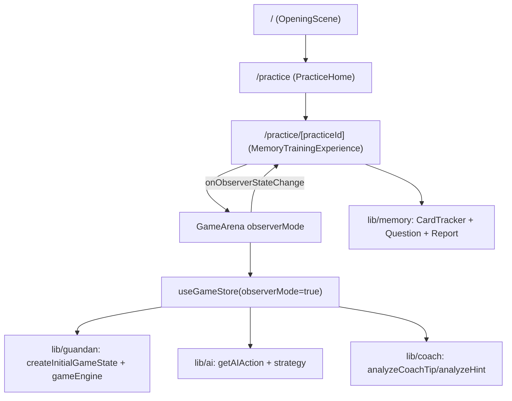

# Code Wiki（掼蛋记牌训练原型）

本文档面向开发者，用于快速理解仓库代码结构、主流程、关键模块与核心函数。内容以“当前代码可运行功能”为准，不把预留页面与未来规划当作已实现功能。

## 目录

- 1. 项目定位与可用路由
- 2. 运行与脚本
- 3. 工程与目录结构
- 4. 核心主流程：/ → /practice → /practice/[practiceId]
- 5. 状态与数据流（GameArena / useGameStore / lib）
- 6. 掼蛋规则与牌局引擎（lib/guandan）
- 7. 记牌训练模块（lib/memory + features/practice）
- 8. AI 与 Coach（规则驱动）
- 9. 内容与素材（content / data / assets / public）
- 10. 类型系统（types）
- 11. 常用定位手册（“我想改 X 应该看哪里”）

## 1. 项目定位与可用路由

当前仓库是“移动端优先的掼蛋训练原型”，对用户开放的训练闭环只有记牌训练（Memory Training）。关键约束来自 [AGENTS.md](../AGENTS.md) 与 [ARCHITECTURE.md](./ARCHITECTURE.md)。

### 1.1 可访问路由（已实现）

- `/`：开场页（OpeningScene）
- `/practice`：记牌训练入口（PracticeHome）
- `/practice/[practiceId]`：记牌训练实例（MemoryTrainingExperience）

路由入口在：

- `app/page.tsx`
- `app/practice/page.tsx`
- `app/practice/[practiceId]/page.tsx`

### 1.2 存在但被隐藏的路由（预留/未开放）

middleware 会把以下前缀统一重定向到 `/practice`，因此不能视为当前产品开放能力：

- `/assessment`
- `/coach`
- `/complete`
- `/design-system`
- `/growth-report`
- `/history`
- `/learning-path`
- `/lessons`
- `/paths`
- `/profile`

实现位置：[`middleware.ts`](../middleware.ts)

## 2. 运行与脚本

### 2.1 依赖与技术栈

关键依赖来自 [`package.json`](../package.json)：

- Next.js 14（App Router）
- React 18
- TypeScript 5
- Tailwind CSS
- framer-motion（微交互）
- gsap / @gsap/react（动画能力，部分页面/组件可能使用）
- ogl（WebGL/特效能力，按需使用）

### 2.2 本地启动

```bash
pnpm install
pnpm dev
```

说明：

- `pnpm dev` 实际执行 `node scripts/dev-frontend.mjs`，强制使用 `localhost:3000`，并在端口被占用且 Next 试图自动切换端口时直接退出（避免开发时端口漂移）。
- 后端为占位健康检查服务：

```bash
pnpm dev:backend
```

默认 `localhost:8000`，仅提供 `/health`，可按 `FRONTEND_ORIGIN` 输出 CORS 头：[`backend/server.mjs`](../backend/server.mjs)

### 2.3 质量检查与构建

```bash
pnpm typecheck
pnpm lint
pnpm build
```

## 3. 工程与目录结构

### 3.1 顶层目录职责

```text
app/                 Next.js 路由（页面只做结构/组合）
components/          通用 UI 组件（牌、牌桌、训练场、布局、基础 UI）
features/            按业务域拆分的“体验/流程”组件（practice 等）
lib/                 规则/引擎/服务：guandan、ai、coach、memory、assets、storage...
store/               牌局状态管理（useReducer + action/reducer）
content/             内容源（案例、课程、路径、题库等数据文件）
data/                可同步/导入的数据镜像（JSON）
types/               共享类型定义
hooks/               通用 hook（localStorage 等）
public/              静态资源（图片、音频、manifest）
assets/manifests/    素材清单（assetId 的索引入口）
scripts/             构建/同步脚本（Python/Node）
```

### 3.2 路由与“页面只负责组合”的约定

本仓库遵循：

- 页面路由放在 `app/`
- 页面文件只负责结构、数据读取与组件组合
- 复杂业务逻辑放在 `features/`、`hooks/`、`lib/`

对应规则说明见 [AGENTS.md](../AGENTS.md) 与 [ARCHITECTURE.md](./ARCHITECTURE.md)

## 4. 核心主流程：/ → /practice → /practice/[practiceId]

### 4.1 主流程概览



### 4.2 `/practice`：训练入口页

- 页面：`app/practice/page.tsx`
- 体验组件：[`features/practice/PracticeHome.tsx`](../features/practice/PracticeHome.tsx)

当前 PracticeHome 直接链接到一个固定训练 id（用于进入训练实例），可作为“入口占位”。

### 4.3 `/practice/[practiceId]`：训练实例页（SSG 参数 + 存在性校验）

页面：[`app/practice/[practiceId]/page.tsx`](../app/practice/%5BpracticeId%5D/page.tsx)

关键行为：

- `generateStaticParams()`：从 `samplePracticeCases` 生成静态参数（用于构建期预渲染）
- `getPracticeById(practiceId)`：不存在则 `notFound()`
- 渲染训练体验：`<MemoryTrainingExperience />`

内容来源（目前主要用于 SSG 与存在性校验）：[`content/cases/sample-practice.ts`](../content/cases/sample-practice.ts)

## 5. 状态与数据流（GameArena / useGameStore / lib）

### 5.1 “状态真源”与分层

当前训练场的状态分为两类：

- 引擎状态（牌局真源）：`GameEngineState`（`lib/guandan/gameState.ts` 定义）
- UI/体验层状态（面板开关、计时器、全屏等）：`GameArena` 的本地 `useState/useRef`

其中 `GameEngineState` 由 `store/gameStore.ts` 使用 `useReducer` 管理，并通过 `useGameStore()` 暴露给 UI。

### 5.2 useGameStore：对 UI 暴露的 API

实现位置：[`store/gameStore.ts`](../store/gameStore.ts)

对外返回：

- `state: GameEngineState`
- `currentPlayer / userPlayer`
- `selectedCardIds`
- `isUserTurn`：是否允许玩家交互（非 observerMode + 轮到 player + playing）

对外动作（dispatch 封装）：

- 训练阶段：`startTraining()`、`continueTraining()`、`restart()`
- 手牌选择：`selectCard(card)`、`setSelectedCards(cards)`、`clearSelectedCards()`、`sortHand()`
- 出牌：`playSelectedCards()`、`pass()`
- Coach：`requestTip()`、`showSolution()`
- 记牌器：`toggleCardCounter()`
- 行动条/回合清理：`setTurnAction(turnAction)`、`clearRoundActions()`
- AI 自动推进：`runAIAction()`

### 5.3 GameArena：训练场 UI 编排与 observerMode

实现位置：[`components/game/GameArena.tsx`](../components/game/GameArena.tsx)

关键点：

- 通过 `useGameStore(observerMode)` 读取牌局状态与派发动作
- 在 `observerMode` 或“当前玩家为 AI”时，建立 5 秒节奏的倒计时并触发 `runAIAction()` 自动推进
- 通过 `onObserverStateChange?.(state)` 把引擎状态回传给上层体验（记牌训练用它读取 `history`）
- 当 `observerPaused` 为 true（记牌挑战弹窗期间），会清掉 `aiActionKeyRef` 以保证恢复后从当前行动继续推进

### 5.4 GameEngineState：核心字段

定义位置：[`lib/guandan/gameState.ts`](../lib/guandan/gameState.ts)

建议把它理解为“牌局引擎状态 + 训练场 UI 状态的组合体”，关键字段包括：

- 牌局核心：`players`、`currentTurn`、`lastPlayedCards`、`lastPlayerId`、`passCount`、`turnNumber`、`winner`、`gameStatus`
- 训练阶段：`trainingPhase: "idle" | "playing" | "analysis" | "completed"`
- 出牌与校验：`selectedCards`、`invalidCardIds`、`invalidPulseKey`
- 回合展示：`currentRoundActions`、`roundComplete`、`roundClearKey`
- 行动条：`turnAction`、`playerActionState`
- 记牌器：`cardCounterVisible`、`cardRemainingCount`
- 动画状态：`animationState`
- Coach：`coachMessage`、`coachFeedback`、`tipMessage`

### 5.5 history：记牌训练的关键数据接口

`history: GameHistoryEntry[]` 由引擎在每次 `playCards/passTurn` 时写入，包含：

- `turn`
- `playerId / playerName`
- `action: "play" | "pass"`
- `cards: Card[]`
- `result: string`（牌型/结果）

记牌训练通过读取 `history` 来统计“关键牌出现次数”、生成题目与报告。

## 6. 掼蛋规则与牌局引擎（lib/guandan）

该层目标是把“牌、牌型、比较、发牌、状态、状态转移”做成可复用的规则模块，被 `store/gameStore.ts` 调用。

### 6.1 模块清单

目录：[`lib/guandan/`](../lib/guandan)

- `card.ts`：牌结构与工具（排序/label/统计）
- `deck.ts`：两副牌构建、seed 洗牌、发牌
- `player.ts`：4 家玩家模型（固定 PlayerId 与 seat/team/kind）
- `cardRule.ts`：牌型识别（single/pair/triple/tripleWithPair/straight/bomb/fourJokers）
- `cardCompare.ts`：压制规则（candidate 是否能出）
- `turnManager.ts`：轮转策略（当前为简单 next）
- `gameState.ts`：状态定义与初始化（createInitialGameState 等）
- `gameEngine.ts`：纯函数状态转移（toggle/play/pass/clearSelection）

### 6.2 核心入口与关键函数

#### createInitialGameState(seed?)

位置：[`createInitialGameState`](../lib/guandan/gameState.ts)

职责：

- 构建两副牌并按 seed 洗牌（`createDeck/shuffleDeck`）
- 发牌到 4 家并初始化玩家（`dealCards/initializePlayers`）
- 生成训练场初始状态（turnAction、cardRemainingCount、coachFeedback 等）

#### playCards(state, playerId, cards)

位置：[`playCards`](../lib/guandan/gameEngine.ts)

职责：

- 校验“轮到谁出牌”、是否能压过上一手（`canBeatLastPlay`）
- 扣除手牌，写入 `lastPlayedCards/lastPlayerId`
- 生成 `currentRoundActions` 与 `history` 记录
- 更新 `cardRemainingCount`（记牌器剩余）
- 更新 `turnAction/playerActionState` 与 `animationState`

返回值：

- `{ state, ok, message }`，由上层决定如何做 UI/Coach 反馈

#### passTurn(state, playerId)

位置：[`passTurn`](../lib/guandan/gameEngine.ts)

职责：

- 禁止“有牌权时不出”（`lastPlayedCards.length === 0` 或 `lastPlayerId === playerId`）
- 记录 pass，并在“一圈都不出”时清空 `lastPlayedCards`，把牌权回到上一位出牌者（round reset）
- 写入 `currentRoundActions/history`，并触发 `roundComplete/roundClearKey`

#### detectCardPattern(cards)

位置：[`detectCardPattern`](../lib/guandan/cardRule.ts)

职责：

- 将 `Card[]` 识别为牌型，并输出 `{ valid, type, power, message? }`
- 当前仅覆盖训练所需的基础牌型与炸弹/四王

#### canBeatLastPlay(candidate, lastCards)

位置：[`canBeatLastPlay`](../lib/guandan/cardCompare.ts)

职责：

- 判断候选牌是否可作为本轮出牌
- 特判四王最大、炸弹可压非炸弹，其余要求牌型一致且 `power` 更大

## 7. 记牌训练模块（lib/memory + features/practice）

### 7.1 MemoryTrainingExperience：训练编排

位置：[`features/practice/MemoryTrainingExperience.tsx`](../features/practice/MemoryTrainingExperience.tsx)

训练层状态：

- `stage: "intro" | "playing" | "report"`（训练 UI 阶段）
- `state: GameEngineState | null`（从 GameArena 回传的引擎状态快照）
- `question: MemoryQuestion | null`（记牌挑战题）
- `records: MemoryAnswerRecord[]`（答题记录）

关键交互：

- Intro 点击“开始训练”进入 playing
- playing 渲染 `GameArena observerMode`
- 当 `question` 存在时，传入 `observerPaused` 暂停 AI 推进，弹出挑战题
- 训练结束（`state?.gameStatus === "finished"`）可进入 report

### 7.2 CardTracker：从 history 统计“出现/剩余”

位置：[`lib/memory/CardTracker.ts`](../lib/memory/CardTracker.ts)

关键类与方法：

- `new CardTracker()`：构建两副牌总量映射 `total`
- `snapshot(history)`：
  - 统计每个 label 的出现次数 `appeared`
  - 计算剩余 `remaining`
  - 生成 `jokerAppeared` 与 `events`（按 turn 映射的简化记录）

### 7.3 题目生成：createMemoryQuestion(snapshot, checkpoint)

位置：[`lib/memory/MemoryQuestionGenerator.ts`](../lib/memory/MemoryQuestionGenerator.ts)

题型：

- `joker`：每第 3 次 checkpoint（checkpoint % 3 === 0）追踪大小王出现数量
- `quantity`：checkpoint % 3 === 2，问 A/2/SJ/BJ 中“剩余最少的那种还剩多少”
- `inference`：其余 checkpoint，做一个“残局推理”型问题（当前实现用最近出牌者映射为答案，属于可控占位逻辑）

### 7.4 报告生成：buildMemoryReport(records)

位置：[`lib/memory/MemoryReport.ts`](../lib/memory/MemoryReport.ts)

输出：

- `accuracy`：正确率（0-100）
- `categories`：三类题型按 1~5 评分
- `advice`：根据最弱项给出一句建议

## 8. AI 与 Coach（规则驱动）

### 8.1 AI：getAIAction + strategy

位置：

- [`lib/ai/AIPlayer.ts`](../lib/ai/AIPlayer.ts)
- `lib/ai/strategy.ts`（出牌策略组合）

当前 `getAIAction(..., level="normal")`：

- 调用 `chooseNormalMove(hand, lastPlayedCards)` 产出要出的牌
- 若无牌可出则 pass
- 非 normal 等级返回占位结果

在自动推进中，`store/gameStore.ts` 会做防卡死 fallback：当 AI 选择了非法“不出”导致 `passTurn` 不 ok 时，会尝试按“有牌权出单张”的策略推进至少一手（见 `ai-action` 分支）。

### 8.2 Coach：analyzeCoachTip / analyzeHint

位置：[`lib/coach/CoachAnalyzer.ts`](../lib/coach/CoachAnalyzer.ts)

对外函数：

- `analyzeCoachTip({ state })`：每次状态变化时给出“当下解读”，包含
  - 游戏结束：`generateGameReview(state)`（来自 `training/replay`）
  - 警告：`detectContextualWarning(state)`（MistakeDetector）
  - 轮到 AI：提示观察策略
  - 玩家已选合法牌：提示“是否压过/是否拆牌型”
  - 残局：手牌 ≤ 6 给出收尾建议
  - 默认：中局“先处理散牌”
- `analyzeHint(state)`：点击提示/展示解法时触发
  - 调用 `recommendDecision({ playerHand, state })`（DecisionEngine）
  - 若有推荐牌，则把 label 拼成 “建议出：...”

Store 与 Coach 的结合点：

- `withCoach(state)` 会调用 `analyzeCoachTip({ state })`
- `applyCoachFeedback(state, feedback)` 会把 `coachFeedback/coachMessage` 写回到 `GameEngineState`

## 9. 内容与素材（content / data / assets / public）

### 9.1 content vs data

- `content/`：面向“内容编辑/开发者写入”的 TS 数据源（案例、课程、路径、题库）
- `data/`：JSON 镜像/同步产物（可被脚本生成或与外部系统对齐）

当前记牌训练路由使用的案例数据在：

- `content/cases/sample-practice.ts`

注意：虽然仓库里存在 daily-training、lessons、paths、assessment 等内容与 features，但这些入口路由当前被 middleware 隐藏。

### 9.2 assetId 与清单

素材引用应通过 assetId 统一管理，清单位于：

- `assets/manifests/image-manifest.json`
- `assets/manifests/animation-manifest.json`

静态资源存放于 `public/assets/*`，包括训练场背景、对手头像、扑克牌面等。

## 10. 类型系统（types）

目录：[`types/`](../types)

按领域拆分的类型文件常见包括：

- `types/game.ts`：训练场/牌桌相关类型（ArenaPlayer 等）
- `types/poker.ts`：扑克牌面/牌型相关类型（UI 层）
- `types/practice.ts`：练习/训练实例的数据结构
- 以及 `lesson/quiz/training-session` 等预留领域类型

阅读顺序建议：

1. `lib/guandan/gameState.ts`（引擎真源状态）
2. `types/game.ts`（UI 展示需要的结构）
3. `types/practice.ts`（训练内容结构）

## 11. 常用定位手册（“我想改 X 应该看哪里”）

### 11.1 我想改入口与路由

- 路由入口：`app/*/page.tsx`
- 隐藏/开放策略：[`middleware.ts`](../middleware.ts)

### 11.2 我想改“记牌挑战”的出题频率、题型或判分

- 检查点触发：[`MemoryTrainingExperience`](../features/practice/MemoryTrainingExperience.tsx) 的 `handleStateChange`
- 题型生成：[`createMemoryQuestion`](../lib/memory/MemoryQuestionGenerator.ts)
- 报告与建议：[`buildMemoryReport`](../lib/memory/MemoryReport.ts)
- 统计方式：[`CardTracker.snapshot`](../lib/memory/CardTracker.ts)

### 11.3 我想改“AI 自动推进”节奏或暂停逻辑

- observer/AI 倒计时：[`GameArena`](../components/game/GameArena.tsx)（aiTimerRef/aiActionKeyRef）
- 实际推进动作：[`useGameStore.runAIAction`](../store/gameStore.ts) → `ai-action` reducer 分支

### 11.4 我想改牌型规则、比较规则或出牌合法性

- 牌型识别：`lib/guandan/cardRule.ts`
- 压制比较：`lib/guandan/cardCompare.ts`
- 状态转移：`lib/guandan/gameEngine.ts`（playCards/passTurn）

### 11.5 我想改教练提示文案与规则

- 总体提示：`lib/coach/CoachAnalyzer.ts`（analyzeCoachTip/analyzeHint）
- 具体决策推荐：`lib/coach/DecisionEngine.ts`
- 错误检测：`lib/coach/MistakeDetector.ts`

